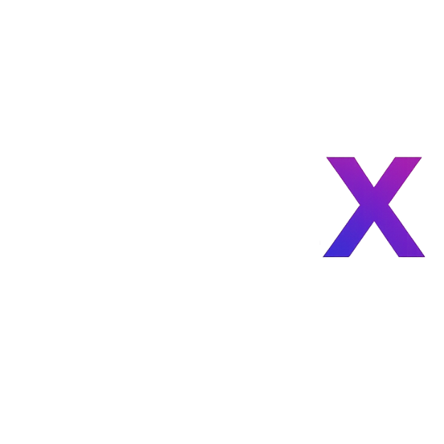

# GuardianX (adc-gx-kadena)

Mobile-friendly Kadena wallet validation API and UI.  
Hybrid ML/rule-based risk engine, ISO20022 export, RWA stub, failover public sources, logs, and security middlewares.

## Features
- `/validate` risk scoring (ML + rules)
- ISO20022 XML export
- 3 failover public sources for scamdb, tx_count, age
- RWA checker stub
- Persistent logs in SQLite
- Secure: rate limit, body size, security headers, CORS, error handlers, optional proof-of-work

## Tech stack
- Python 3.11, FastAPI, SQLModel, scikit-learn, joblib
- Mobile-first web UI (dark theme)
- Docker-ready, Render deployable

## Getting Started
1. `cp .env.example .env` and adjust
2. `docker build -t guardianx . && docker run -p 8080:8080 guardianx`
3. Or `uvicorn app.main:app --reload`
4. Run tests: `pytest`

## Endpoints
- `POST /validate`
- `GET /health`
- `GET /iso/export`

## License
MIT License © ADCoinX

## Logo
